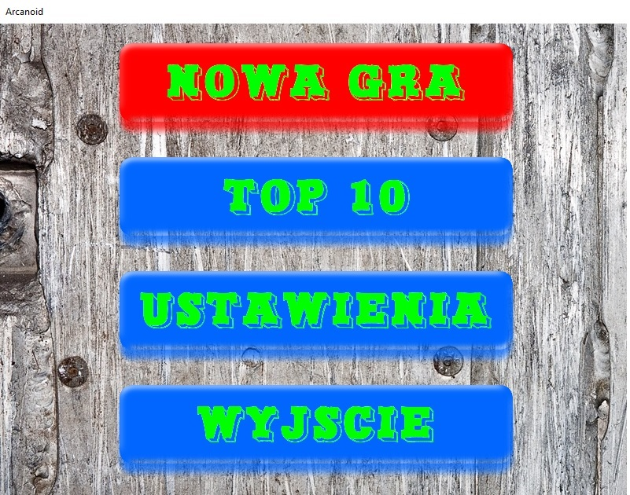
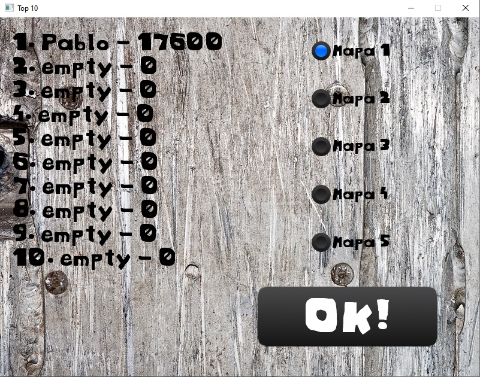
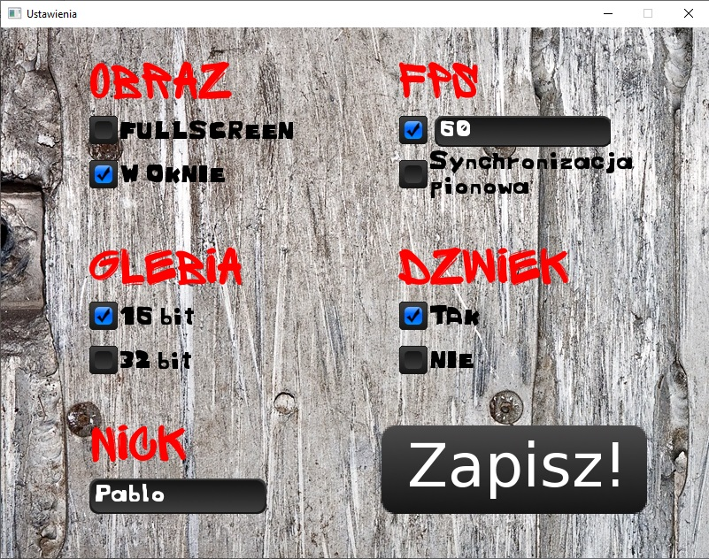
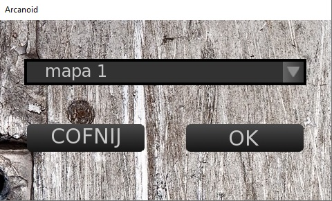
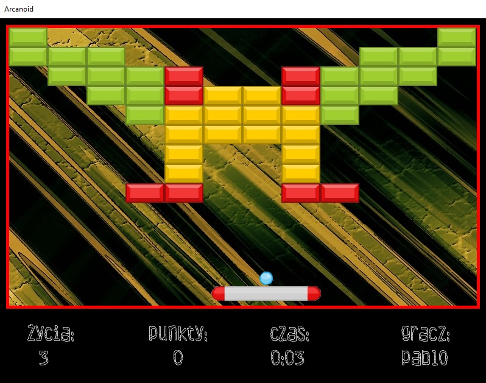

# Arcanoid-game

## ENG

A game written in the second semester of Computer Science at the Poznań University of Technology. It was commissioned in May 2015. It was the second best project of the year and my first such a large program. Due to little experience at the time, the code is of poor quality, but it works reliably. Technologies used: C++, SFML, TGUI.
  
I wrote the game for 3 weeks. It contains 5 maps (maps are loaded from text files), 4 background images selected randomly, TOP10 for each map, settings where you can change screen settings, turn on/off sound, etc.
Required for compilation:
- SFML library version 2.3
- TGUI library version 0.6
- Visual Studio

Other versions of TGUI are not supported as the author has completely rewritten the code. I am attaching the rebuilt libraries - the author on his website made available only the source code of this version. Also included is version 2.3 of the SFML library.
Game files and dll libraries are automatically copied during the compilation process - so I do not recommend changing the structure of the project.

## PL

Gra napisana w drugim semestrze kierunku Informatyka Politechniki Poznańskiej. Został oddany w maju 2015 r. Był to drugi najlepszy projekt na roku oraz pierwszy tak duży program w moim wykonaniu. Z uwagi na niewielkie wówczas doświadczenie, kod jest słabej jakości, ale działa niezawodnie. Wykorzystane technologie: C++, SFML, TGUI.
  
Grę pisałem 3 tygodnie. Zawiera 5 map (mapy są wczytywane z plików tekstowych), 4 obrazy tła wybierane losowo, TOP10 dla każdej z map, ustawienia gdzie można zmienić ustawienia ekranu, włączyć/wyłączyć dźwięk itp. 
Do skompilowania wymagane jest:
- biblioteka SFML w wersji 2.3
- biblioteka TGUI w wersji 0.6
- Visual Studio

Inne wersje TGUI nie są obsługiwane, ponieważ autor całkowicie przepisał kod. Załączam przebuildowane biblioteki - autor na swojej stronie udostępnił tylko kod źródłowy tej wersji. Załączm również wersję 2.3 biblioteki SFML.
Pliki gry oraz biblioteki dll są automatycznie kopiowane podczas procesu kompilacji - nie polecam więc zmiany struktury projektu.

## Screenshots

### Menu

### Top10

### Settings

### Select map

### Game
